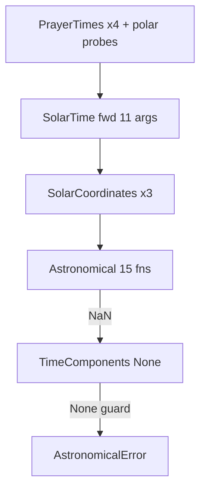
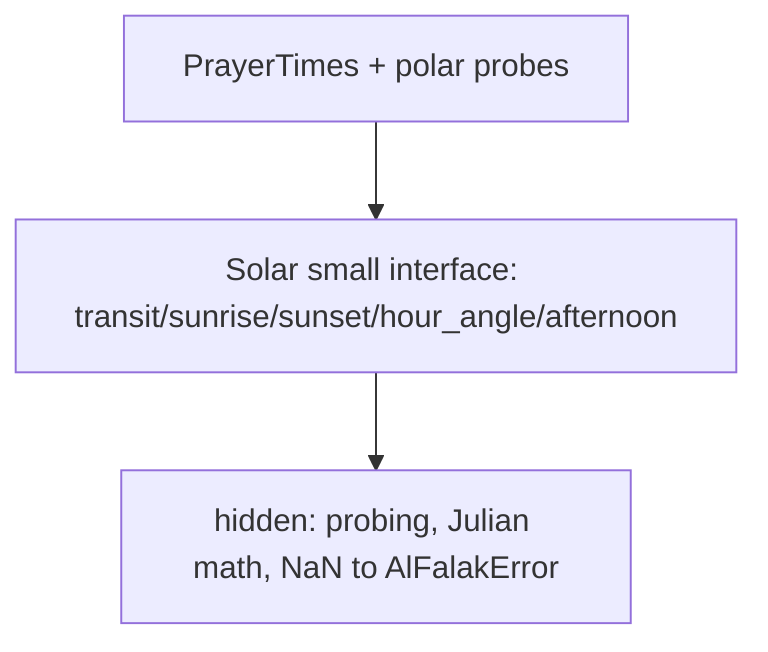
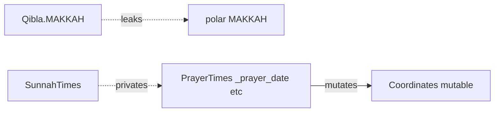
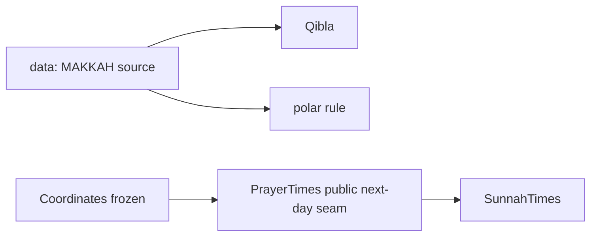

# Architecture review — deepening opportunities (2026-09-30)

> Converted from `/tmp/architecture-review-20260930-183255.html` for headless use.
> Source HTML retained at `/tmp/architecture-review-20260930-183255.html`.

Vocabulary: **module**, **interface**, **depth**, **seam**, **adapter**, **leverage**, **locality**.
No `CONTEXT.md` exists, so domain names come from `ARCHITECTURE.md`
(prayer times, calculation method, polar rule, night portion, shadow length).
No `docs/adr/` exists, so there are no ADR conflicts.
Hot spots from `git log`: AlFalakError hierarchy (#34), Asr polar edge (#33),
polar derivation (#31), validation + packaging (#32), CLI (#28), test hardening (#39).

## How to read this report

**Depth** = behaviour behind a small **interface**. **Shallow** = interface
nearly as complex as implementation. The **deletion test**: delete the module —
if complexity reappears across N callers it earned its keep; if it vanishes it
was pass-through.

**Seam** = where a module's interface lives. **Adapter** = what sits at a seam.
One adapter = hypothetical seam; two adapters = real seam. **Leverage** = what
callers gain; **locality** = bugs, change and verification concentrated in one
place.


---

## 1 · The calculation-configuration cluster is shallow — `Strong`

**Files:**
`src/alfalak/calculation/CalculationMethod.py:4-74` ·
`src/alfalak/calculation/MethodsParameters.py:6-47` ·
`src/alfalak/calculation/CalculationParameters.py:13-101` ·
`src/alfalak/calculation/HighLatitudeRule.py:4-22` ·
`src/alfalak/calculation/Madhab.py:6-19` ·
`src/alfalak/data/NightPortions.py:4-7`

### Problem

Answering "what does EGYPTIAN do?" needs 4 modules: doc enum →
`dict[CalculationMethod, dict[str,Any]]` table → blind `setattr` loop
(`CalculationParameters.py:96-101`) → `night_portions()` mapping (`:84-94`).
The table rows are heterogeneous (UMM_AL_QURA has `isha_interval` but no
`isha_angle`; KUWAIT lacks method adjustments; NONE is `{}`). Keys are bare
strings, so a typo creates a stray attribute. User-passed angles are silently
overwritten by the table ("method is last assigned and has precedence",
`:51,69`). `madhab` and `high_latitude_rule` are unchecked at construction
and fail later (`PrayerTimes.py:312-313`,
`CalculationParameters.py:94` with a message that omits the value).
`Madhab.get_shadow_length()` → `ShadowLength` → float is three hops for 1.0
vs 2.0. Each enum module fails the **deletion test**: deleting it moves
complexity, it does not concentrate it.

### Solution

Deepen one configuration **module** behind one small **interface**: typed
method defaults (TypedDict / frozen record, not `dict[str,Any]`), explicit
precedence (method defaults vs caller overrides), eager validation of every
field at construction, and the night-portion mapping owned by the same module.
Keep the enums as labels; move behaviour (defaults, fractions, shadow factor)
inside so callers learn one seam.

### Benefits

**Locality:** overwrite order, table shape, angle-vs-interval confusion
(UMM_AL_QURA docstring vs table), and "invalid rule" messages live in one
place. **Leverage:** every caller and test constructs configuration the same
way; fewer setup permutations. Tests cross the same **seam** as callers, so
table-shape regressions are caught through the **interface**, not by poking
internals.

### Before — shallow cluster, wide interface

```text
CalculationMethod (12 labels, docs only)
  ↓
METHODS_PARAMETERS (dict[str,Any], heterogeneous rows)
  ↓
CalculationParameters (setattr loop + split validation)
  ↓
night_portions()  |  Madhab → ShadowLength → float
```

### After — one deep module, small interface

```text
Calculation configuration
  small interface: method + overrides → validated record
  ↓
Deep implementation: typed defaults · precedence ·
  eager validation · night fractions · shadow factor
  ↓
PrayerTimes learns one seam
```

---

## 2 · The solar seam leaks celestial wiring — `Strong`

**Files:**
`src/alfalak/astronomy/SolarTime.py:14-88` ·
`src/alfalak/astronomy/Astronomical.py:148-186` ·
`src/alfalak/astronomy/SolarCoordinates.py:17-41` ·
`src/alfalak/util/TimeComponents.py:15-35` ·
`src/alfalak/PrayerTimes.py:152-192`

### Problem

`corrected_hour_angle` takes 11 params
(`m0, h0, coordinates, afterTransit, Θ0, α2, α1, α3, δ2, δ1, δ3`) with mixed
naming; `SolarTime` forwards the same 11-arg tuple three times, distinguished
once by a bare boolean (sunrise `False` vs sunset `True`). Swapping prev/next
declination is silent. Errors travel as `math.nan`
(`Astronomical.py:184`) → `None` (`TimeComponents.from_float:17-18`) →
`AstronomicalError` in `PrayerTimes.py:186,322`, spanning three modules.
`PrayerTimes` repeats the float → `TimeComponents` → `date_components()`
chain four times (`:154-178`) plus polar probes. `SolarCoordinates` (41 lines
→ 3 floats) is recomputed 3× per `SolarTime`. Pure functions, but the real
bugs hide in call wiring — no **locality**.

### Solution

Deepen the solar **module**: keep the pure math where it is as internal
detail, but present a **small interface** (transit / sunrise / sunset /
hour-angle / afternoon) that hides prev/solar/next probing, Julian
conversions, and failure mapping. Raise the domain error at the **seam**
instead of returning NaN/None and re-checking at six call sites. Collapse the
four repeated conversions into the module.

### Benefits

**Locality:** argument-ordering and polar-day/night-undefined logic
concentrate behind one seam; fix once, fixed everywhere. **Leverage:**
`PrayerTimes` and polar probes learn ~4 methods instead of an 11-arg
forwarding discipline. Tests exercise sunrise/sunset/undefined through the
**interface** — the interface is the test surface.

### Before — callers assemble the pipeline



### After — deep solar module



---

## 3 · Fajr / Isha safe-cap logic is duplicated, Asr clamping is split — `Strong`

**Files:**
`src/alfalak/PrayerTimes.py:224-253,255-292,310-341,351-422,440-447` ·
`src/alfalak/calculation/Twilight.py:24-73` ·
`src/alfalak/util/CalendarUtil.py:4-17`

### Problem

`_set_fajr` and `_set_isha` duplicate the safe-cap pattern with divergent
branches (hour-angle probe → MOON_SIGHTING_COMMITTEE seasonal twilight →
night-portion fallback; Fajr caps `temp < safe`, Isha caps
`temp is None or temp > safe`). `Twilight`'s morning/evening functions
duplicate 25 lines, differing only in coefficients. Asr is clamped in two
places far apart (`< dhuhr:336-341` vs `> maghrib:215-219`).
`_rounded_minute` takes a string `prayer_name` and does
`getattr(adjustments, name)` (`:417-418`) — a typo raises bare
`AttributeError` outside the error tree. `_set_isha:359` raises bare
`ValueError` as control flow for `isha_interval < 1`. Magic constants
(`night_length/7000`, `latitude ≥ 55`) sit inline. This is the hottest recent
area (polar derivation #31, Asr edge #33).

### Solution

Deepen the night-and-rounding **module**: one **interface** that, given solar
times + night length + parameters, returns capped Fajr/Isha (and clamps Asr in
the same place). Unify the two Twilight branches over shared coefficients;
replace the stringly `getattr` with typed per-prayer adjustment lookup;
replace `ValueError`-as-control-flow with an explicit interval branch. Keep
`PrayerTimes` as orchestrator; move the decision table behind the new
**seam**.

### Benefits

**Locality:** high-latitude caps, MSC twilight, Asr saturation, and
rounding-after-adjustment ordering live together — the exact cluster that
caused #31/#33. **Leverage:** one set of tests covers both Fajr and Isha
paths instead of two near-identical suites drifting apart.

### Before — mirrored branches + split clamps

```text
_set_fajr (probe → MSC → portion → cap)  |  _set_isha (probe → MSC → portion → cap*)
morning_twilight (a,b,c,d…)              |  evening_twilight (a′,b′,c′,d′…)
Asr<dhuhr clamp                          |  Asr>maghrib clamp
+ getattr(name) · ValueError control flow
```

### After — one deep night module

```text
Night times (fajr / isha / asr-clamp — one interface)
  ↓
shared probe → shared twilight core → shared cap +
  typed adjustments + explicit interval branch
```

---

## 4 · Seams leak: Makkah, privates, mutable coordinates — `Worth exploring`

**Files:**
`src/alfalak/Qibla.py:6,34-40` ·
`src/alfalak/PrayerTimes.py:138,224-253` ·
`src/alfalak/SunnahTimes.py:19-39` ·
`src/alfalak/data/Coordinates.py:8-33`

### Problem

Three leaks across **seams**. (a) `Qibla.MAKKAH` is reused for
`PolarCircleRule.MAKKAH` (`PrayerTimes.py:251`) — the Qibla **seam** leaks
into polar resolution; changing Makkah precision moves prayer times.
(b) `SunnahTimes` reads `prayer_times._prayer_date`,
`calculation_parameters`, `time_zone` and recomputes a full second-day
`PrayerTimes` just for tomorrow's Fajr — coupled to privates; a rename breaks
it. (c) `Coordinates` is a mutable `@dataclass` (ARCHITECTURE.md claims
frozen) and `_resolve_polar_circle` mutates `self.coordinates` /
`_date_components` post-construction (`:236-249`). Tuple-unpack validation is
copy-pasted in `PrayerTimes.py:130-133` and `Qibla.py:23-26`.

### Solution

Put each **seam** where it belongs: own the Makkah location in the data layer
(or keep two explicit constants with one authoritative source) so Qibla and
polar rules do not share an **adapter** by accident; freeze `Coordinates` and
make polar resolution return new values instead of mutating; give
`PrayerTimes` a public **seam** for "next-day derivation" that `SunnahTimes`
uses instead of reaching into privates; unify coordinate coercion in one
module.

### Benefits

**Locality:** timezone/DST arithmetic in `SunnahTimes.py:27-39` and polar
fallback stop depending on invisible internals. **Leverage:** callers get an
honest immutable value type; only one hypothetical **seam** becomes real (the
next-day derivation, which now has two adapters: PrayerTimes itself and
SunnahTimes).

### Before — crossing seams



### After — seams respected



---

## 5 · CLI is a partial adapter drifting from the library — `Worth exploring`

**Files:**
`src/alfalak/__main__.py:8-49` ·
`src/alfalak/__init__.py:1-35`

### Problem

The CLI exposes only `--latitude/--longitude/--date/--method`; every other
`CalculationParameters` field (madhab, high-latitude rule, polar rule,
adjustments, intervals, angles, timezone) has no flag, so new fields silently
drift. It hardcodes `MUSLIM_WORLD_LEAGUE` default and UTC ISO output,
re-parses dates with `strptime` + `build_parser().error()` (`:36-38`, exits
via SystemExit, not the error tree), and mixes
`datetime.now(timezone.utc)` impurity with printing in one function. The
package interface is also uneven: it re-exports 14 names but hides
`NightPortions`, `ShadowLength`, method defaults and Twilight helpers,
forcing bouncing to deep paths; dual import styles
(`alfalak.Coordinates` vs `alfalak.data.Coordinates`) coexist.

### Solution

Treat the CLI strictly as an **adapter** at the library's **seam**: thin
parsing + delegation, no duplicated defaults; date/validation errors mapped
into the same error tree rather than SystemExit; one import style. Decide the
package **interface** deliberately — either export the full value vocabulary
or hide it, but do not leave half-exported. Today there is one real
**adapter** (library callers) and one partial one (CLI): a hypothetical
**seam** until the CLI covers the interface.

### Benefits

**Leverage:** CLI gains every library capability per unit of interface
learned; no parallel flag for every new field (or one explicit
config-passthrough instead of N flags). **Locality:** defaulting and
validation live in the library module, not split across `__main__` and
`PrayerTimes.__init__`.

### Before — duplicated defaults

```text
CLI: defaults MWL · today UTC · 4 flags · strptime+SystemExit
  ↓↯↑
Library: requires method/params · full fields · AlFalakError
```

### After — thin adapter

```text
Library interface: single defaulting + validation seam
  ↑
CLI adapter: parse → delegate → print
```

---

## Top recommendation

Start with **candidate 1 (calculation-configuration cluster)**. It is the
shallowest group, it concentrates the most scattered validation, it unblocks
candidates 3 and 5 (night logic and CLI both consume `CalculationParameters`),
and recent history (error hierarchy, validation, polar rules) shows this is
where change keeps landing — so deepening pays back fastest. Do candidate 2
next if solar-argument-ordering or NaN-chasing has bitten recently; otherwise
take 3 (Fajr/Isha dedup) as the follow-up since it sits directly behind the
same seam.

> No `CONTEXT.md` exists yet — if we name a deepened module after a new
> domain concept (e.g. "night times", "solar"), record it there. No ADRs to
> revisit.

*Evidence-first: every file:line above was read during this review. Deletion
test applied to each enum/holder module.*
